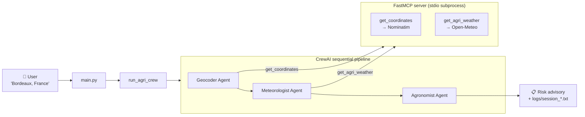
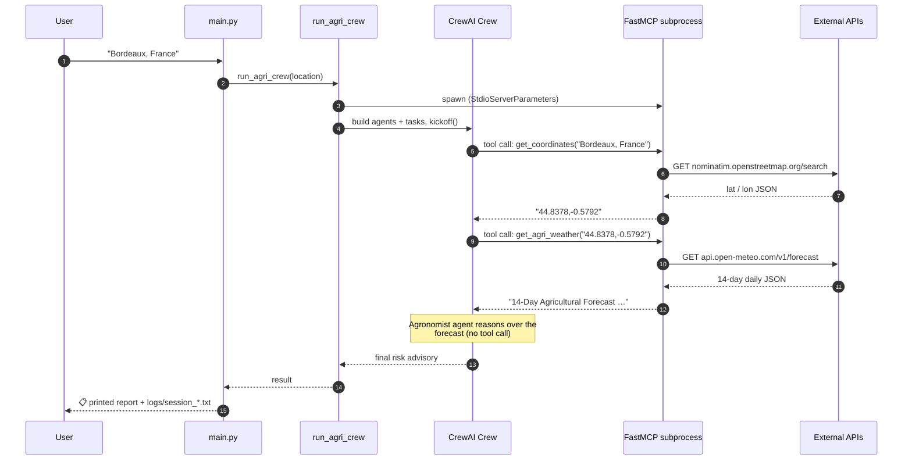

# 🌾 Agri-Weather Forecaster AI

A multi-agent CLI assistant that turns a plain-English location ("Bordeaux,
France", "Napa Valley, California", …) into a **concise, vineyard-focused
agronomic risk report** built from a real 14-day weather forecast.

The tools the agents rely on (geocoding + weather lookup) are **served over the
[Model Context Protocol (MCP)](https://modelcontextprotocol.io/)** by a local
[FastMCP](https://github.com/jlowin/fastmcp) server, so the same tool surface
can be reused by any other MCP-compatible client (Claude Desktop, Cursor,
custom agents, …).

---

## 1. What it does (high level)

1. You type a region at the prompt.
2. A **Geolocation agent** turns that text into latitude / longitude.
3. A **Meteorologist agent** fetches a 14-day daily forecast (max/min temps,
   rain, evapotranspiration) for those coordinates.
4. An **Agronomist agent** scans the forecast for vineyard risks
   (frost, heat stress, fungal disease, drought) and emits a 3–4 sentence
   advisory for a farm manager.
5. The full reasoning trace of each run is saved under `logs/`.



---

## 2. Repository layout

```text
weather_proj/
├── main.py                 ← CLI entry point (REPL loop)
├── README.md
├── src/
│   ├── agent.py            ← CrewAI agents, tasks, crew, MCP client wiring
│   ├── mcp_server.py       ← FastMCP server exposing both tools (stdio)
│   ├── tools.py            ← Legacy in-process tools (kept for reference)
│   ├── prompts.py          ← Backstories + task descriptions
│   ├── config.yaml         ← LLM + embedder configuration
│   └── requirements.txt    ← Python dependencies
├── logs/                   ← Per-run timestamped trace files
└── test_files/             ← Manual integration probes against the raw APIs
    ├── test_geocoding.py
    └── test_weather.py
```

---

## 3. Architecture & technical details

### 3.1 Frameworks and runtime

| Layer | Technology | Notes |
|-------|------------|-------|
| Multi-agent orchestration | **CrewAI** (`Crew`, `Agent`, `Task`, `Process.sequential`) | Sequential pipeline with shared memory + embedder |
| LLM | **Google Gemini 2.5 Flash** via `crewai.LLM` | Configured in [src/config.yaml](src/config.yaml); temperature `0.1` for analytical, deterministic output |
| Memory embedder | `google-generativeai` / `models/embedding-001` | Powers CrewAI's conversational memory |
| Tool transport | **MCP** (Model Context Protocol) over **stdio** | Server is launched as a subprocess by the agent at runtime |
| Tool server | **FastMCP** (`fastmcp.FastMCP`) | Decorator-based registration; JSON Schema generated from Python type hints + docstrings |
| Tool client | `crewai_tools.MCPServerAdapter` + `mcp.StdioServerParameters` | First-party CrewAI ↔ MCP bridge — exposes MCP tools as native CrewAI tools |
| External APIs | **Nominatim** (OpenStreetMap) + **Open-Meteo** | Both free, no API key required |
| Config / secrets | `pyyaml` for `config.yaml`, `python-dotenv` for `.env` | `GEMINI_API_KEY` is the only required secret |

### 3.2 The three agents

Defined in [src/agent.py](src/agent.py); backstories in [src/prompts.py](src/prompts.py).

| # | Role | Tool | Purpose | Output contract |
|---|------|------|---------|-----------------|
| 1 | **Geolocation Specialist** (`geocoder`) | `get_coordinates` (MCP) | Resolve free-text location to lat/lon | `"44.8378,-0.5792"` |
| 2 | **Agricultural Meteorologist** (`meteorologist`) | `get_agri_weather` (MCP) | Fetch a 14-day daily forecast for those coords | Raw multi-line forecast string from the tool, unmodified |
| 3 | **Senior Agronomist** (`agronomist`) | *none — analysis only* | Detect vineyard risks (frost, heat, fungal, drought) and write a 3–4 sentence advisory | Concise risk paragraph |

Backstories are deliberately short and strict (e.g. "Output ONLY the
comma-separated coordinates") to prevent the LLM from looping or padding the
response — this protects the free-tier quota.

### 3.3 The Crew

Configured in `run_agri_crew()` inside [src/agent.py](src/agent.py):

- `process=Process.sequential` — agents run one after the other in declared order.
- `memory=True` — CrewAI conversational memory is enabled, backed by the
  Google embedding model defined in [src/config.yaml](src/config.yaml).
- `output_log_file=logs/session_<timestamp>.txt` — full reasoning trace per run.
- `verbose=True` on both crew and agents — traces also stream to stdout.

### 3.4 MCP server ([src/mcp_server.py](src/mcp_server.py))

```python
from fastmcp import FastMCP
mcp = FastMCP("weather-tools")

@mcp.tool()
def get_coordinates(location_name: str) -> str: ...

@mcp.tool()
def get_agri_weather(coordinates: str) -> str: ...

if __name__ == "__main__":
    mcp.run()          # default transport: stdio
```

- **Transport:** stdio. The agent spawns the server as a subprocess; no port,
  no separate daemon to manage.
- **Schema generation:** FastMCP derives input/output JSON schemas from the
  Python type hints; the docstring becomes the tool description shown to the
  LLM.
- **Reusability:** because the surface is standard MCP, you can also point
  Claude Desktop, Cursor, or `mcp-inspector` at the same script and use the
  tools without touching this repo's agent code.

#### Tools exposed

| Tool name | Input | Calls | Output |
|-----------|-------|-------|--------|
| `get_coordinates` | `location_name: str` (e.g. `"Bordeaux, France"`) | `GET https://nominatim.openstreetmap.org/search` with `User-Agent: AgriWeatherForecaster/1.0` | `"44.837789,-0.57918"` or descriptive error string |
| `get_agri_weather` | `coordinates: str` (`"lat,lon"`) | `GET https://api.open-meteo.com/v1/forecast` with daily `temperature_2m_max`, `temperature_2m_min`, `precipitation_sum`, `et0_fao_evapotranspiration`, `forecast_days=14`, `timezone=auto` | Token-efficient multi-line string, one line per day |

Both tools return **strings** (success or error) rather than raising — this
keeps the LLM's reasoning loop simple and lets the agent surface failures
gracefully.

### 3.5 Agent ↔ MCP wiring

[src/agent.py](src/agent.py):

```python
server_params = StdioServerParameters(
    command=sys.executable,
    args=[MCP_SERVER_SCRIPT],     # absolute path to src/mcp_server.py
    env={**os.environ},           # propagate API keys to the subprocess
)

with MCPServerAdapter(server_params) as mcp_tools:
    geocoding_tool = _pick_tool(mcp_tools, "get_coordinates")
    weather_tool   = _pick_tool(mcp_tools, "get_agri_weather")

    # ... build agents (tools=[geocoding_tool] / [weather_tool]) ...
    # ... build tasks + crew ...
    return crew.kickoff(inputs={"location_input": location_input})
```

Key points:

- The `MCPServerAdapter` context manager **must wrap `crew.kickoff`** —
  exiting the `with` block tears the subprocess down, so construction *and*
  execution happen inside it.
- `_pick_tool` looks tools up by name and falls back to attribute matching for
  forward compatibility across `crewai-tools` versions.
- Environment variables (notably `GEMINI_API_KEY` / `GOOGLE_API_KEY`) are
  propagated explicitly so the subprocess can make HTTPS calls in restricted
  environments.

### 3.6 End-to-end request flow



---

## 4. Setup

### 4.1 Prerequisites
- Python 3.10+
- A Google Gemini API key

### 4.2 Install

```powershell
python -m venv venv
.\venv\Scripts\Activate.ps1
pip install -r src/requirements.txt
```

### 4.3 Configure secrets

Create a `.env` file at the project root:

```dotenv
GEMINI_API_KEY=your-google-gemini-api-key
```

[src/agent.py](src/agent.py) mirrors this into both `GEMINI_API_KEY` and
`GOOGLE_API_KEY` (different Gemini SDKs read different names).

### 4.4 (Optional) Tune the model

Edit [src/config.yaml](src/config.yaml):

```yaml
llm:
  provider: "google"
  model_name: "gemini-2.5-flash"
  temperature: 0.1

embedder:
  provider: "google-generativeai"
  model_name: "models/embedding-001"
```

---

## 5. Running

### 5.1 Full agent pipeline

```powershell
python main.py
```

Then enter a region at the prompt. Type `exit` or `quit` to leave.

### 5.2 MCP server standalone

You can run the FastMCP server on its own to debug or to wire it into another
MCP client (Claude Desktop, Cursor, etc.):

```powershell
python src/mcp_server.py
```

Inspect the tool surface interactively:

```powershell
npx @modelcontextprotocol/inspector python src/mcp_server.py
```

### 5.3 Raw API smoke tests

[test_files/](test_files) contains plain scripts that hit the upstream APIs
directly — useful for isolating "is the API up?" from "is the agent
confused?":

```powershell
python test_files/test_geocoding.py
python test_files/test_weather.py
```

---

## 6. Logging

Every `run_agri_crew` invocation writes a timestamped trace file:

```text
logs/session_YYYYMMDD_HHMMSS.txt
```

Combined with `verbose=True` on the agents and crew, this gives you:
- the exact prompt sent to Gemini for each task,
- every tool call (name + arguments) and its response,
- the final answer of each agent.

---

## 7. Risk-detection rules (Agronomist)

Hardcoded in [src/prompts.py](src/prompts.py) (`AGRONOMIST_BACKSTORY`):

| Risk | Trigger |
|------|---------|
| **Frost** | Daily min temperature `< 0 °C` |
| **Heat stress** | Daily max temperature `> 33 °C` |
| **Fungal disease** (e.g. Downy Mildew) | High rainfall combined with warm temperatures |
| **Drought** | High evapotranspiration with zero rainfall |

The agent emits a **3–4 sentence** advisory highlighting the most severe risk
and suggesting one actionable preventative measure.

---

## 8. Extending the system

Because tools live behind an MCP boundary, adding a new capability is a
**single-file change** plus a one-line agent wiring:

1. Add a new `@mcp.tool()` function in [src/mcp_server.py](src/mcp_server.py).
2. In [src/agent.py](src/agent.py), pick it up via
   `_pick_tool(mcp_tools, "your_new_tool")` and pass it into the relevant
   agent's `tools=[…]` list.

No changes are needed in [main.py](main.py), [src/prompts.py](src/prompts.py),
or [src/config.yaml](src/config.yaml) unless you are introducing a new agent
or task.

---

## 9. Troubleshooting

| Symptom | Likely cause | Fix |
|---------|--------------|-----|
| `GEMINI_API_KEY not found in .env file.` | Missing or misnamed env file | Create `.env` at repo root with the key |
| `Tool 'get_coordinates' not found on MCP server` | `crewai-tools` version mismatch | `pip install -U "crewai-tools[mcp]"` |
| Tool call hangs at startup | Subprocess can't import `fastmcp` | Activate the venv before `python main.py`, or hardcode the venv's `python.exe` in `StdioServerParameters.command` |
| `requests.exceptions.SSLError` | Corporate TLS interception | `pip-system-certs` is already pinned in `requirements.txt`; reinstall it inside the venv |
| Empty / nonsense forecast | Bad coordinates from geocoder | Try a more specific location (city + country) |

---

## 10. Tech stack at a glance

- **Python 3.10+**
- **CrewAI** — multi-agent orchestration
- **Google Gemini 2.5 Flash** — reasoning LLM
- **FastMCP** — Pythonic MCP server framework
- **MCP** (`mcp` package) — protocol primitives (`StdioServerParameters`)
- **crewai-tools** — `MCPServerAdapter` for the client side
- **Nominatim / OpenStreetMap** — free geocoding
- **Open-Meteo** — free agricultural weather API
- **PyYAML**, **python-dotenv**, **pip-system-certs**, **requests**
