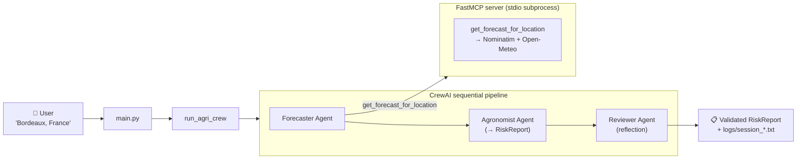
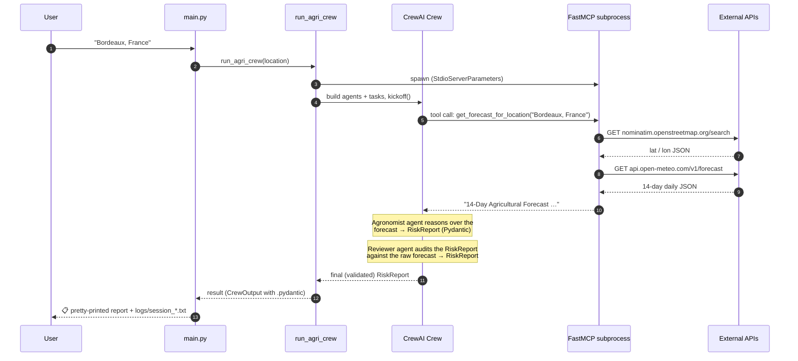

# 🌾 Agri-Weather Forecaster AI

A multi-agent CLI assistant that turns a plain-English location ("Bordeaux,
France", "Napa Valley, California", …) into a **structured, vineyard-focused
agronomic risk report** built from a real 14-day weather forecast.

The tool the agents rely on (combined geocoding + weather lookup) is
**served over the
[Model Context Protocol (MCP)](https://modelcontextprotocol.io/)** by a local
[FastMCP](https://github.com/jlowin/fastmcp) server, so the same tool surface
can be reused by any other MCP-compatible client (Claude Desktop, Cursor,
custom agents, …).

---

## 0. What I learned & implemented about Agentic AI

This project is a hands-on study of how to build a small but production-shaped
agentic system. Concretely, it covers:

### 0.1 Agentic reasoning patterns applied here

| Pattern | Where it lives | Why it matters |
|---------|----------------|----------------|
| **Role-based multi-agent decomposition** | `Forecaster`, `Agronomist`, `Reviewer` agents in [src/agent.py](src/agent.py) | Each agent has a narrow `role` + `goal` + `backstory`, which reduces hallucination and keeps reasoning focused. |
| **Sequential pipeline / chain-of-agents** | `Process.sequential` Crew with explicit `context=[…]` between tasks | The output of one agent is a typed, deterministic input to the next — no implicit shared state. |
| **ReAct (Reason + Act) tool use over MCP** | `Forecaster` agent → `get_forecast_for_location` MCP tool | The LLM reasons about the request, calls the tool, observes the result, and continues. The transport is standard MCP — not a CrewAI-only convention. |
| **Structured output (schema-guided reasoning)** | `RiskReport` Pydantic model + `output_pydantic=RiskReport` on tasks in [src/agent.py](src/agent.py) | Forces the LLM into a machine-parseable JSON shape (severity, primary_risk, affected_dates, recommendation, summary). |
| **Reflection / self-critique** | The `Reviewer` agent re-checks the Agronomist's `RiskReport` against the raw forecast | Catches mis-classified severity, fabricated dates, generic recommendations — the single biggest quality lever. |
| **Rule-based / checklist prompting** | `AGRONOMIST_BACKSTORY` in [src/prompts.py](src/prompts.py) with quantified frost / heat / fungal / drought triggers | Turns vague "analyse the weather" into a deterministic rubric the LLM can apply. |
| **Guardrailed prompting (anti-rambling)** | Strict "do not add filler", "act like a busy farmer" instructions | Saves tokens and protects the free-tier API quota. |
| **Explicit context passing over implicit memory** | `memory=False` + `context=[task_forecast]` / `context=[task_forecast, task_analysis]` | For a linear pipeline this is cheaper, more deterministic, and avoids spurious embedding-store calls. |
| **Tool isolation behind a protocol boundary** | FastMCP server launched as a subprocess via `StdioServerParameters` | Tools become reusable across clients (Claude Desktop, MCP Inspector, …) and can be replaced without touching agent code. |
| **Deterministic tool composition** | Geocoding + forecast fetch are fused into one MCP tool (`get_forecast_for_location`) instead of two LLM-wrapper agents | Saves an LLM round-trip and removes a class of "the agent forgot to pass the coordinates" failures. |
| **Resilient tool I/O** | `tenacity` retry with exponential backoff + shared `requests.Session` + timeouts in [src/mcp_server.py](src/mcp_server.py) | Transient network failures don't surface as agent errors. |
| **Observability** | `verbose=True` on agents + Crew, plus `output_log_file=logs/session_*.txt` | Every prompt, tool call, and response is captured for post-mortem. |

### 0.2 Things I deliberately did NOT use (and why)

- **Hierarchical / delegating agents** (`allow_delegation=False` everywhere) —
  for a 3-step linear job, a manager agent only adds tokens and unpredictability.
- **Tree-of-Thought / planner-executor splits** — overkill for a problem whose
  control flow is known up front.
- **CrewAI's built-in `memory=True`** — replaced with explicit `context=[…]`
  wiring because the pipeline is linear and embedding-based recall adds cost
  and non-determinism.
- **LLM-driven tool routing for geocoding** — collapsed into a single
  deterministic MCP tool. The LLM only reasons where reasoning is actually
  needed (risk analysis + review).

### 0.3 Engineering lessons that ended up in the code

- **Prompts are an interface.** Short, strict, quantified prompts beat
  flowery ones for free-tier LLMs.
- **Schemas beat parsing.** Returning a Pydantic model lets `main.py` render
  results without regex or string scraping.
- **Reflection ≠ retry.** A second agent reviewing the first one's *typed*
  output (not just re-running it) is what actually fixes mistakes.
- **Push determinism down the stack.** Anything that doesn't need an LLM
  (HTTP retries, array zipping, path resolution) should be plain Python,
  not a prompt.
- **Resolve paths from `__file__`, never from `cwd`.** A subprocess-spawning
  MCP setup will eventually be launched from somewhere unexpected.

---

## 1. What it does (high level)

1. You type a region at the prompt.
2. A **Forecaster agent** calls one MCP tool that geocodes the location and
   fetches a 14-day daily forecast (max/min temps, rain, evapotranspiration).
3. An **Agronomist agent** scans the forecast for vineyard risks
   (frost, heat stress, fungal disease, drought) and emits a structured
   `RiskReport` (Pydantic).
4. A **Reviewer agent** audits that report against the raw forecast and
   returns a corrected `RiskReport` if anything is off.
5. The full reasoning trace of each run is saved under `logs/`.



---

## 2. Repository layout

```text
weather_proj/
├── main.py                 ← CLI entry point (REPL loop + result renderer)
├── README.md
├── src/
│   ├── agent.py            ← CrewAI agents, tasks, crew, MCP client wiring
│   ├── mcp_server.py       ← FastMCP server exposing the combined tool (stdio)
│   ├── prompts.py          ← Backstories, task descriptions, RiskReport schema
│   ├── tools.py            ← Legacy in-process tools (kept for reference)
│   ├── config.yaml         ← LLM + embedder configuration
│   └── requirements.txt    ← Python dependencies
├── logs/                   ← Per-run timestamped trace files
└── test_files/             ← Manual integration probes against the raw APIs
    ├── test_geocoding.py
    └── test_weather.py
```

---

## 3. Architecture & technical details

### 3.1 Frameworks and runtime

| Layer | Technology | Notes |
|-------|------------|-------|
| Multi-agent orchestration | **CrewAI** (`Crew`, `Agent`, `Task`, `Process.sequential`) | Sequential pipeline with explicit per-task `context=[…]`; no global memory. |
| LLM | **Google Gemini 2.5 Flash** via `crewai.LLM` | Configured in [src/config.yaml](src/config.yaml); temperature `0.1` for analytical, deterministic output. |
| Structured output | **Pydantic** (`RiskReport`) via `output_pydantic=` on tasks | Schema-guided reasoning + parse-free downstream rendering. |
| Tool transport | **MCP** (Model Context Protocol) over **stdio** | Server is launched as a subprocess by the agent at runtime. |
| Tool server | **FastMCP** (`fastmcp.FastMCP`) | Decorator-based registration; JSON Schema generated from Python type hints + docstrings. |
| Tool client | `crewai_tools.MCPServerAdapter` + `mcp.StdioServerParameters` | First-party CrewAI ↔ MCP bridge. |
| Resilience | **tenacity** (exponential backoff, 3 attempts) + shared `requests.Session` + 15s timeout | Wraps every outbound HTTP call inside the MCP server. |
| External APIs | **Nominatim** (OpenStreetMap) + **Open-Meteo** | Both free, no API key required. |
| Config / secrets | `pyyaml` for `config.yaml`, `python-dotenv` for `.env` | `GEMINI_API_KEY` is the only required secret. |

### 3.2 The three agents

Defined in [src/agent.py](src/agent.py); backstories and the `RiskReport`
schema live in [src/prompts.py](src/prompts.py).

| # | Role | Tool | Purpose | Output contract |
|---|------|------|---------|-----------------|
| 1 | **Agri-Weather Forecaster** (`forecaster`) | `get_forecast_for_location` (MCP) | Resolve free-text location → 14-day forecast in a single call | Raw multi-line forecast string from the tool, unmodified |
| 2 | **Senior Agronomist** (`agronomist`) | *none — analysis only* | Detect the single most severe vineyard risk and emit a structured report | `RiskReport` (Pydantic: `severity`, `primary_risk`, `affected_dates`, `recommendation`, `summary`) |
| 3 | **Chief Agronomy Reviewer** (`reviewer`) | *none — audit only* | Cross-check the Agronomist's `RiskReport` against the raw forecast; correct it if needed | `RiskReport` (validated or corrected) |

The Agronomist applies a **quantified** rubric (not just "look for risks"):

| Risk | Trigger |
|------|---------|
| **Frost** | Min Temp `< 0 °C` |
| **Heat stress** | Max Temp `> 33 °C` |
| **Fungal** | ≥ 2 consecutive days with Rain `> 5 mm` AND Max Temp `> 18 °C` |
| **Drought** | ≥ 5 consecutive days with EvapoT `> 3 mm` AND Rain `== 0 mm` |

### 3.3 The Crew

Configured in `run_agri_crew()` inside [src/agent.py](src/agent.py):

- `process=Process.sequential` — agents run one after the other in declared order.
- `memory=False` — CrewAI's embedding-based memory is **off**. Context flows
  via explicit `context=[task_forecast]` (analysis) and
  `context=[task_forecast, task_analysis]` (review) instead.
- `output_pydantic=RiskReport` on the analysis and review tasks — the
  framework parses the LLM output into a `RiskReport` automatically.
- `output_log_file=logs/session_<timestamp>.txt` — full reasoning trace per run.
- `verbose=True` on both crew and agents — traces also stream to stdout.

### 3.4 MCP server ([src/mcp_server.py](src/mcp_server.py))

```python
from fastmcp import FastMCP
mcp = FastMCP("weather-tools")

@mcp.tool()
def get_forecast_for_location(location_name: str) -> str: ...

if __name__ == "__main__":
    mcp.run()          # default transport: stdio
```

- **Transport:** stdio. The agent spawns the server as a subprocess; no port,
  no separate daemon to manage.
- **Schema generation:** FastMCP derives input/output JSON schemas from the
  Python type hints; the docstring becomes the tool description shown to the
  LLM.
- **Resilience:** all outbound HTTP goes through a single `_http_get` helper
  wrapped in `tenacity.retry` (3 attempts, exponential backoff, retry only on
  `ConnectionError` / `Timeout`).
- **Reusability:** because the surface is standard MCP, you can also point
  Claude Desktop, Cursor, or `mcp-inspector` at the same script and use the
  tool without touching this repo's agent code.

#### Tool exposed

| Tool name | Input | Calls (internally) | Output |
|-----------|-------|--------------------|--------|
| `get_forecast_for_location` | `location_name: str` (e.g. `"Bordeaux, France"`) | `GET nominatim.openstreetmap.org/search` → `GET api.open-meteo.com/v1/forecast` with daily `temperature_2m_max`, `temperature_2m_min`, `precipitation_sum`, `et0_fao_evapotranspiration`, `forecast_days=14`, `timezone=auto` | Token-efficient multi-line forecast string, one line per day, or a descriptive error string |

The tool returns a **string** on both success and failure — this keeps the
LLM's reasoning loop simple and lets the agent surface failures gracefully
instead of raising.

### 3.5 Agent ↔ MCP wiring

[src/agent.py](src/agent.py):

```python
server_params = StdioServerParameters(
    command=sys.executable,
    args=[MCP_SERVER_SCRIPT],     # absolute path to src/mcp_server.py
    env={**os.environ},           # propagate API keys to the subprocess
)

with MCPServerAdapter(server_params) as mcp_tools:
    forecast_tool = _pick_tool(mcp_tools, "get_forecast_for_location")
    # ... build forecaster / agronomist / reviewer agents ...
    # ... build tasks (with output_pydantic + explicit context) and Crew ...
    return crew.kickoff(inputs={"location_input": location_input})
```

Key points:

- The `MCPServerAdapter` context manager **must wrap `crew.kickoff`** —
  exiting the `with` block tears the subprocess down, so construction *and*
  execution happen inside it.
- `_pick_tool` looks tools up by name and falls back to attribute matching for
  forward compatibility across `crewai-tools` versions.
- Environment variables (notably `GEMINI_API_KEY` / `GOOGLE_API_KEY`) are
  propagated explicitly so the subprocess can make HTTPS calls in restricted
  environments.

### 3.6 End-to-end request flow



---

## 4. Setup

### 4.1 Prerequisites
- Python 3.10+
- A Google Gemini API key

### 4.2 Install

```powershell
python -m venv venv
.\venv\Scripts\Activate.ps1
pip install -r src/requirements.txt
```

### 4.3 Configure secrets

Create a `.env` file at the project root:

```dotenv
GEMINI_API_KEY=your-google-gemini-api-key
```

[src/agent.py](src/agent.py) mirrors this into both `GEMINI_API_KEY` and
`GOOGLE_API_KEY` (different Gemini SDKs read different names).

### 4.4 (Optional) Tune the model

Edit [src/config.yaml](src/config.yaml):

```yaml
llm:
  provider: "google"
  model_name: "gemini-2.5-flash"
  temperature: 0.1

embedder:
  provider: "google-generativeai"
  model_name: "models/embedding-001"
```

> The embedder is currently unused because `memory=False`. It's kept in config
> so re-enabling memory is a one-line flip.

---

## 5. Running

### 5.1 Full agent pipeline

```powershell
python main.py
```

Then enter a region at the prompt. Type `exit` or `quit` to leave.

### 5.2 MCP server standalone

You can run the FastMCP server on its own to debug or to wire it into another
MCP client (Claude Desktop, Cursor, etc.):

```powershell
python src/mcp_server.py
```

Inspect the tool surface interactively:

```powershell
npx @modelcontextprotocol/inspector python src/mcp_server.py
```

### 5.3 Raw API smoke tests

[test_files/](test_files) contains plain scripts that hit the upstream APIs
directly — useful for isolating "is the API up?" from "is the agent
confused?":

```powershell
python test_files/test_geocoding.py
python test_files/test_weather.py
```

---

## 6. Logging

Every `run_agri_crew` invocation writes a timestamped trace file:

```text
logs/session_YYYYMMDD_HHMMSS.txt
```

Combined with `verbose=True` on the agents and crew, this gives you:
- the exact prompt sent to Gemini for each task,
- every tool call (name + arguments) and its response,
- the final answer of each agent (including the structured `RiskReport`).

`main.py` also prints a pretty-rendered summary of the final `RiskReport`
(`severity`, `primary_risk`, `affected_dates`, `recommendation`, `summary`)
when the run completes, and falls back to raw output if the LLM produced
something unparseable.

---

## 7. Extending the system

Because tools live behind an MCP boundary, adding a new capability is a
**single-file change** plus a one-line agent wiring:

1. Add a new `@mcp.tool()` function in [src/mcp_server.py](src/mcp_server.py)
   (route it through `_http_get` to inherit retries + timeout).
2. In [src/agent.py](src/agent.py), pick it up via
   `_pick_tool(mcp_tools, "your_new_tool")` and pass it into the relevant
   agent's `tools=[…]` list.

Adding a new structured output field is similarly local:

1. Add the field to `RiskReport` in [src/prompts.py](src/prompts.py).
2. Mention it in `get_analysis_task_desc()` so the LLM populates it.

No changes are needed in [main.py](main.py) or [src/config.yaml](src/config.yaml)
unless you are introducing a new agent or task, or changing the LLM.

---

## 8. Troubleshooting

| Symptom | Likely cause | Fix |
|---------|--------------|-----|
| `GEMINI_API_KEY not found in .env file.` | Missing or misnamed env file | Create `.env` at repo root with the key |
| `Tool 'get_forecast_for_location' not found on MCP server` | `crewai-tools` version mismatch | `pip install -U "crewai-tools[mcp]"` |
| Tool call hangs at startup | Subprocess can't import `fastmcp` / `tenacity` | Activate the venv before `python main.py`, or hardcode the venv's `python.exe` in `StdioServerParameters.command` |
| `requests.exceptions.SSLError` | Corporate TLS interception | `pip-system-certs` is already pinned in `requirements.txt`; reinstall it inside the venv |
| Final report is a raw JSON string instead of pretty-printed fields | LLM emitted invalid JSON for `RiskReport` | Re-run; if persistent, lower temperature in `config.yaml` or tighten `get_analysis_task_desc()` |
| Empty / nonsense forecast | Bad geocoding hit | Try a more specific location (city + country) |

---

## 9. Tech stack at a glance

- **Python 3.10+**
- **CrewAI** — multi-agent orchestration (`Process.sequential`, `output_pydantic`, explicit `context=[…]`)
- **Google Gemini 2.5 Flash** — reasoning LLM
- **Pydantic** — structured `RiskReport` schema
- **FastMCP** — Pythonic MCP server framework
- **MCP** (`mcp` package) — protocol primitives (`StdioServerParameters`)
- **crewai-tools** — `MCPServerAdapter` for the client side
- **tenacity** — retry / backoff for outbound HTTP
- **Nominatim / OpenStreetMap** — free geocoding
- **Open-Meteo** — free agricultural weather API
- **PyYAML**, **python-dotenv**, **pip-system-certs**, **requests**
